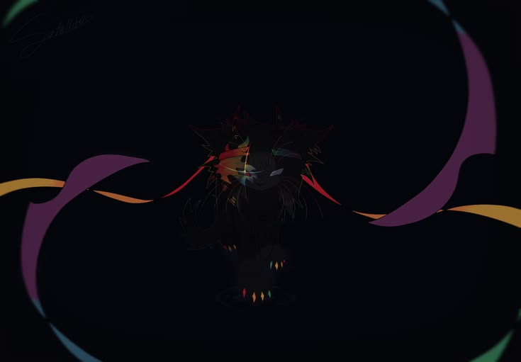

# Intro
Hello, I go by "vio" as my primary nickname, I have some a bunch of potential but only know how to do very few coding things, anything else is just hopes and prayers.

  

# Friends
[Rome](https://www.github.com/RomanLordz) - Peak  
[bakersrule2020](https://www.github.com/bakersrule2020) - Modder  
[tedmcbur](https://github.com/tedmcbur) - Decent  
  
# What I Made  
I used to make extensions on this Scratch copy called [PenguinMod](https://extensions.penguinmod.com), I also worked on several small Roblox scripts however none of them are extremely good.
